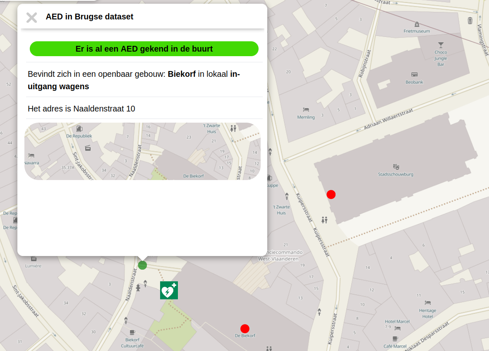

Data importeren in OpenStreetMap
================================

Om een dataset te importeren, zijn er enkele stappen die doorlopen moeten worden:

0. Geschikte data
1. Licentie nakijken
2. Importeermethode bepalen
3. Community inlichten en Importeren voorbereiden
4. Importeren!

## 0. Geschikte data

Is de data die je wenst te importeren geschikt voor OpenStreetMap? Is ze dus verifieerbaar ter plaatse door een andere contributor? Is ze ietwat permantent?

## 1. Licentie nakijken

Voordat we een dataset in OpenStreetMap kunnen toevoegen, moeten we nagaan of dit wel mag van de oorspronkelijke maker van de dataset.

Is er een licentievermelding bij de databron? Kijk deze dan na of er toestemming is voor hergebruik (ook commercieel) en redistributie.
Indien er een attributie voor de dataset moet zijn, dan kan de bronvermelding in de changeset (als source) aangeduid worden en/of kan de auteur vermeld worden op [deze wikipagina]. **Vraag na of deze bronvermelding voldoende is**

## 2. Importeermethode bepalen

De volgende vraag is hoe deze data geimporteerd zal worden. Ook hier moeten verschillende vragen beantwoord worden:

1. Wie doet de import?
2. Is een survey nodig?
3. Welke tools worden ingezet?
4. Tagging bepalen

### Wie importeert?

Een ervaren contributor vergelijkt de bestaande OSM-data met de aangeleverde dataset. Duplicaten worden gefiltered en geupdate.
Dit is vooral geschikt voor kleinere dataset (maximaal enkele honderd feaures), maar is sneller (want minder coordinatie is nodig).

Indien een grotere dataset geimporteerd dient te worden, is dit vaak niet meer haalbaar door één enkele persoon.
Als dit het geval is, zal men contributors moeten zoeken om mee te helpen importeren.
Dit kan heel passief (de data online plaatsen en de community er attent op maken dat deze bestaat, in de hoop dat er iemand dit oppikt),
tot actief een groep vrijwilligers zoeken.
Ten slotte kan men hier ook een betaalde kracht voor inhuren - een GIS-expert binnen de organisatie, een jobstudent of een OpenStreetMap-expert die men betaald

### Is een survey nodig?

Indien de dataset oud is of veel fouten bevat, is het wellicht wenslijk om ter plaatse te gaan kijken. Dit hangt sterk af van dataset tot dataset, of men de data op luchtfoto's kan afleiden, via mapillary of OpenStreetCam de situatie ter plaatse kan zien, ...

Vaak helpt het om terreinkennis te hebben, om de import voor te bereiden door alle data te overlopen, toe te voegen waar men zeker van is en enkel de twijfelgevallen over te houden voor import.

### Welke tools worden ingezet?

Indien er één ervaren gebruiker de import doet, zal die wellicht JOSM (of zijn favoriete editor gebruiken).

Voor extreem grote imports (meer dan 1000 objecten) zal men wellicht ook coordineren via een tasking manager (om werkgebieden per contributor af te bakenen).

Voor een import waar survey wenselijk is (ihb indien er verschillende contributors betrokken zijn), kan MapComplete ingezet worden waar de na te zien data ingeladen wordt.
MapComplete kan:

- tegelijk een laag van OpenStreetMap én de te importeren data tonen . 
- de te importeren objecten verbergen indien er een OpenStreetMap-object dichtbij is
- aanbieden om het te importeren object toe te voegen indien dit object ontbreekt (*)
- aanbieden om gegevens van het te importeren object over te zetten op een naburig, soortgelijk object (*)

(*) Opties 3 en 4 vereisen een degelijke voorbereiding van de te importeren dataset en zijn niet altijd mogelijk of niet altijd de moeite

Op de screenshot hieronder is een voorbeeld te zien van het importeren van een dataset van Brugse defibrillatoren.

- De vierkante logo's zijn AEDs die in OpenStreetMap gekend zijn
- Een bolletje is een AED die in de Brugse dataset gekend is
- Een bolletje wordt groen gekleurd indien er een AED in OSM gekend is binnen een straal van 25 meter
- In de popup wordt relevante informatie getoond uit de te importeren dataset

Een geavanceerder voorbeeld van een import is het UK-address-importproject.
Hierbij wordt met een dataset van vermoedelijke adressen gewerkt. 
Indien er geen gebouw met adres dit vermoedelijke adres omsluit, wordt er gevraagd om dit adres toe te voegen. Door het adres via deze popup toe te voegen, wordt er meteen een INSPIRE-referentie meegegeven.

### Tagging bepalen en filteren voor duplicaten

Ten slotte moet de data ook nog 'vertaald' worden naar het correct OpenStreetMap-formaat.

De softwareprogramma's ook overweg kunnen met het dataformaat. **Geojson** is een veilige keuze, want dit open formaat wordt door veel editors ondersteund. Met QGIS kunnen shapefiles omgezet worden in geojson. Een geojson kan ook als extra laag in MapComplete geladen worden.

Daarnaast moeten de attributen van de data omgezet moeten worden naar de OpenStreetMap-attributen - raadpleeg de wiki voor de correcte tags.
Dit kan bijvoorbeeld met QGIS of met JOSM gedaan worden.

Ten slotte moet men ook voorkomen dat er duplicaten ontstaan: twee objecten in OpenStreetMap die beiden hetzelfde voorwerp voorstellen.

## 3. Community inlichten en importeren voorbereiden

Indien er een grote import gaat gebeuren, dient de community hiervan ingelicht te worden. Door dit in de community te bespreken, worden fouten voorkomen. Ook helpt dit om medecontributors warm te maken en niet-betrokken contributors geen verassingen te bezorgen.

Voor een import die enkel in Belgie plaatsvindt, volstaat een email naar talk@osm.be ; voor een globale import moet men ook best naar import@openstreetmap.org sturen.

Voor kleinere datasets is dit slechts een formaliteit - zeker indien de data gedubbelcheckt gaat worden.

Ondertussen kan de import voorbereid worden door op kleine schaal te importeren (bv. een beperkt gebied of een beperkt aantal punten).
Indien er een MapComplete-thema wordt opgezet, kan dit ook al getest worden en naar de community gestuurd worden.

## 4. Importeren!

Na enkele weken zijn we hier eindelijk aangeland! Tijd om de data in OpenStreetMap te importeren! 
