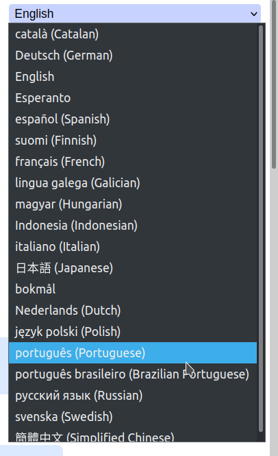
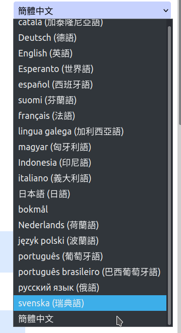

# The language-picker

(Originally published as diary-entry)


In my [little OpenStreetMap-editor](https://mapcomplete.org) translations are provided by contributors on [hosted weblate](https://hosted.weblate.org/projects/mapcomplete/), where thousands of text snippets have been translated already in the past year - which is awesome. 

However, the language picker was a bit dry: it used to have codes for every language, e.g. `nl`, `en`, `ja`, 'pt_BR', 'zh_Hant'... Quite boring and not really user-friendly - but easy to implement.

Today, I decided to give these an overhaul. I wanted to show proper language names in them. But: in which _language_ should we show the language overview?

Should we show the language option in the language itself? Or should the languages be shown in the _current language_? Showing in the _current language_ also means that the name of every language should be translated too - a huge task... Also, translating every language has the drawback that, if a user accidentally selects a language in a foreign writing system, they'll won't be able to find their language in all the "gibberish".

### Best of both worlds

I decided to offer the best of both worlds: in the menu, first language name is shown as the native speaker speaks it, followed by the language name in the _current language_ (except if both are the same)

This means that, in all circumstances, everyone can find their language.

But, where to fetch every language name in every language?

# Wikidata to the rescue

Of course, the internet must have a list of languages translated in every language. But where to find it or compile it?

I decided to have a look at one of the biggest repositories of knowledge: Wikidata. They do have an entry for every language (e.g. [Dutch](https://www.wikidata.org/wiki/Q7411)). To fetch every [modern language](https://www.wikidata.org/wiki/Q1288568), we turn to the SPARQL-endpoint with the following query:

``` sparql
SELECT ?lang ?label ?code
        WHERE
        {
          ?lang wdt:P31 wd:Q1288568.
          ?lang rdfs:label ?label.
          ?lang wdt:P424 ?code
        } 
```

This one fetches all languages and uses the labels in every language as their translation. With a Typescript these can be downloaded and used as translation.

## The messy real world

Of course, real life isn't as easy. There are dialects, differences in notation between Weblate and Wikipedia (e.g. `zh-hant` vs `zh-Hant`). But with a few exceptions, this can be fixed too. Some pragmatism doesn't hurt - even though it is nice that it works for most cases automatically.

[The full script is available here](https://github.com/pietervdvn/MapComplete/blob/develop/scripts/fetchLanguages.ts). 

# Results



