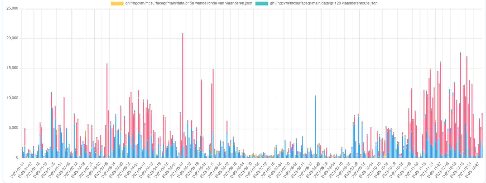
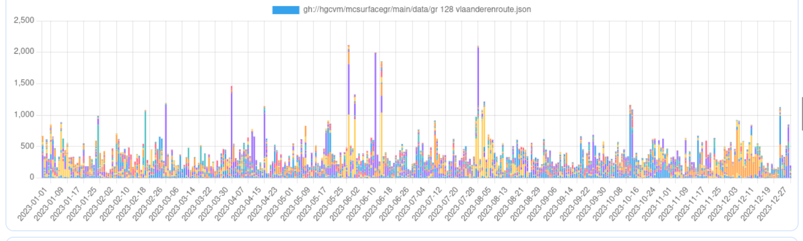
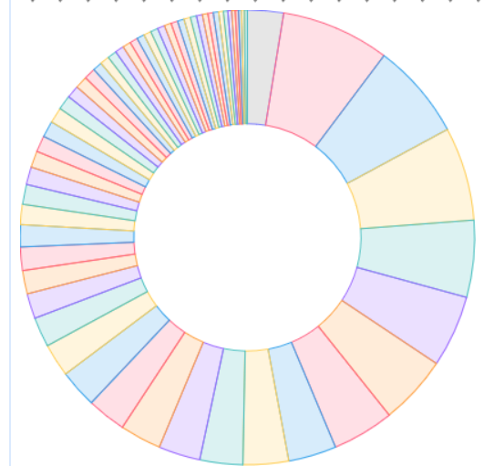
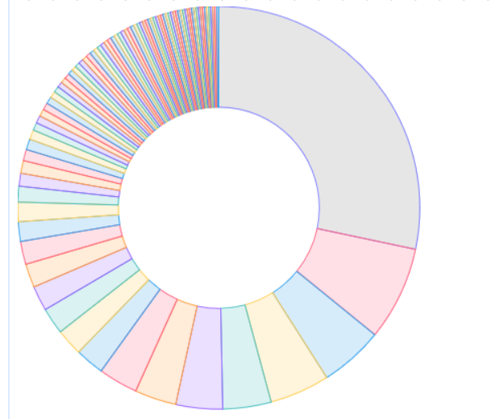
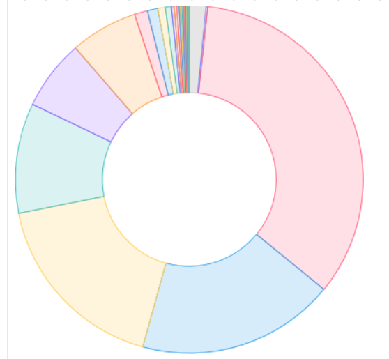

# 2023 in review

Now that 2023 has come to an end, it is an appropriate time to take a look back and see what has happened within the MapComplete-sphere.

2023 also marked the year that I (pietervdvn) received a grant by NlNet, meaning that I could spend a ton of time on improving MapComplete - and with success.

Looking back, a humongous amount of work happened. I'm giving a quick recap here.

## User survey and other statistics

I've started the year with orienting myself. I ran a user survey (part [1](https://www.openstreetmap.org/user/Pieter%20Vander%20Vennet/diary/401127), [2](https://www.openstreetmap.org/user/Pieter%20Vander%20Vennet/diary/401133) and [3](https://www.openstreetmap.org/user/Pieter%20Vander%20Vennet/diary/401152)) and analyzed how mapcomplete was used.
For example, there are some interesting statistics about [the number of pictures created](https://www.openstreetmap.org/user/Pieter%20Vander%20Vennet/diary/400716) and [about the reviews that were made](https://www.openstreetmap.org/user/Pieter%20Vander%20Vennet/diary/400854)

## Lots of improvements

Most of the work of course went to programming MapComplete, which underwent a few big changes (notably the UI-framework and Mapping-library) and received numerous small improvements.

A quick recap:

### Svelte (Q1)

The first big change of the year was switching to an _actual_ frontend framework. MapComplete was written in a hand-rolled framework, which wasn't very performant.
And while I really loved it, using Svelte made the frontend more approachable for other programmers, more maintainable and faster.

Svelte was chosen partly because it works and has a large ecosystem, but also because it turns out to be conceptually similar to the previous, handrolled framework.
Even better: the old framework is so similar, that they can be used together! With a few tweaks and adaptions, they were made compatible.

The big advantage of this compatibility is that it becomes possible to _gently_ migrate. Instead of porting everything at once, component per component can be switched when the time is right. As such, there are still a few components around written in the old framework, but they are slowly getting replaced.

Another important bit here is that I received lots of help, both in making the choice of Svelte and actually switching.
I received help from Tobias (and the rest from fixmycity.de), but also from Robin van der Linde and Wouter van der Wal.
They had experience with Svelte - which I lacked. They basically did all the nasty configuration files and the adapter classes.
Back then, it was as if they used some arcane magic to get it all working ;) Luckily, I know Svelte better know, so I at least know how to do such a tricks. But the configuration files are still scary...

### UX overhaul

A designer from FixMyCity Berlin had a look to MapComplete as well; they worked out a conceptual framework to design mapcomplete against.
The calmer, cleaner, gray-based design is thanks to them.

Furthermore, they gave some feedback on various flows, which made the app more consistent and easier to use.

### MapLibre (June)

Another big change was replacing Leaflet and using MapLibre instead.
This was another big change which had some fallout, but is worth it in the long run.
Not only does it give more possibilities (such as rotating the map or pitching it for a 3D-view),
it also paves the way for more optimalisations later on (which I've just begun working on).

### Move of domain name (August)

In august, I've finally made the switch to a proper domain name: mapcomplete.org. This change had quite some fallout, 
as MapComplete relies on several external services which suddenly need to be updated.

### Studio

Another big, new feature is MapComplete studio, which allows to create new map layers without having to know the JSON-configuration.
I have to be honest: it works, but there are still many bugs and inconsistencies. It is not as good as it can be, but I'll be fixing small issues when someone complains about them (and when I do have time)

### Export-functionality

Another neat feature which has been polished up and released is the 'export'-functionality.
This allows everyone to export the visible data as CSV, PNG or PDF, ideal to further process the map data.

There even is a 'line only'-export function, which, in combination with the cycle-infra theme, is perfect to get an SVG-road map.
With some post-processing, this can be fed into a 3D-printer...

### Imgur data backup

Imgur - our image host - announced a change to their policy indicating that _they might start deleting old, unused pictures_.
As such, many people were a bit worried and we started backing up all pictures on image which are linked to from OpenStreetMap.

This collection of around 30K images has several copies now with various people.

And, as it turned out, only 6 of them became dead. It seems that Imgur's policy was mostly applied on a specific kind of pictures, namely [the indecent type](https://piped.video/watch?v=zBDCq6Q8k2E)...

## New themes and theme improvements

Of course, various improvements to the map themes were made. There are too much improvements to sum them all, but I'd like to give an overview of themes that have been officially added to MapComplete this year:

- [advertising](https://mapcomplete.org/advertising)
- [clock](https://mapcomplete.org/clock)
- [elongated_coin](https://mapcomplete.org/elongated_coin)
- [guideposts](https://mapcomplete.org/guideposts)
- [icecream](https://mapcomplete.org/icecream)
- [vending_machine](https://mapcomplete.org/vending_machine)
- [walkingnodes](https://mapcomplete.org/walkingnodes)

This is a small amount of themes, especially compared to 2022 when 25 new themes were added.
This is partly because I focused on improving the system itself (and not on creating new themes) and partly because there was no Open Summer of Code this year,
which traditionally meant the addition of many new themes and layers.

Another reason is that many topical maps already exist by now - especially the broadly applicable ones. As such, there is less need to create new ones.

And maybe I should improve Studio further and officialize a few of those themes. In either case, if you have a thematic map or layer lying around,
let me know and we'll add it to official mapcomplete!

And even though there weren't many new themes added, quite some improvements were made to the already existing themes.
For example, drinking water was improved with more specific questions, one can indicate what services a hackerspace offers, 
...

### Accessibility

One of the last big changes made in 2023 is the effort to make MapComplete more accessible for people using screenreaders, braille devices or similar.
This effort is still ongoing (but nearly finished). In a few weeks time, MapComplete went from being utterly unusable to being (nearly) feature-equivalent for blind people.

## Community 

2023 was the year that the community had a small but healthy growth.

### Community calls

In the first 6 months, there were biweekly community calls. They were mostly between Pietervdvn and Tordans, but often joined by Robin 
or people passing by once to tell about their project.

After the summer holiday, the community calls waned and weren't restarted - I was to busy and neglected them a bit.
But - rejoice: we will restart them! The next one is [on friday the 26th of january, 14:00 CET](https://mobilizon.openstreetmap.fr/events/568afd3a-d18a-4ff0-acc4-626d6d09d6d5). 

### Patrons

Another nice milestone is that two more patrons started pledging a small amount for the development of MapComplete.

I'm now [receiving €1.03 per week via Liberapay](https://liberapay.com/pietervdvn). I'd like to thank my three patrons for the trust and small financial contribution!

If you feel like becoming a patron too, [head over to Liberapay](https://liberapay.com/pietervdvn).

### Mastodon-accounts

Another _huge_ success in 2023 were the mastodon-accounts.

The [MapComplete-account](https://en.osm.town/@MapComplete) had 800 followers in march, which passed the 1.000 mark in August and around 1200 at the time of writing,
with a few new followers daily.

Another success is the [automated account](https://botsin.space/@mapcomplete/) which posts a small, daily overview of changes made with MapComplete,
including up to 12 pictures which were made the day before. 133 people follow this account, and there was some interaction every day (e.g. a star, a boost or a small message)

Another fun fact: the automated account was registered on the 12th of january 2023, so it is a year old now!

## Change Metrics

But of course, the most interesting statistics are how MapComplete was used in the past year.

Some basic logging is done with [goatcounter](https://pietervdvn.goatcounter.com), which shows around 200 up to 300 visitors per day on average.
That isn't a neglectable amount, but it is not very big either. On the other hand, I suspect that goat counter misses quite a few visitors.
OSM-people tend to be privacy-aware and run scriptblocker, which'll also block goatcounter.

Also, there is a big gap in December. The script was not properly configured and thus not counting visitors.

However, the most interesting stastic is of course how much changes are made to OpenStreetMap with MapComplete. 
There is a small, unpolished, irregularly updated [statistics page on MapComplete](https://mapcomplete.org/statistics) which
has some nice statistics, so lets dive in!

### Modifications name sorted by theme

Lets start our little analysis by the graph "number of changed objects per theme".
This graph is dominated by two themes. One of them, the *'GRB'*-theme (in red) is quite a special theme which causes thousands of changed objects, on one day even more then 18.000 changed objects by a single person.
This might seem like an extra-ordinary amount for MapComplete, which is supposed to focus on individual POIs...

However, the GRB theme is a very special theme which helps to import building data in Flanders.
As such, this is a glorified copy-paste from the governmental dataset into OpenStreetMap, which causes this ampount of changes.




### The etymology theme

The second theme causing thousands of changes is the *etymology*-theme. Here to, some automation inflates the numbers:
when one selects a road and applies an etymology to it, _all_ nearby segments with the same name get this etymology applied,
which in some cases can amount to quite some changed segments - often five to ten, but sometimes even 50 or 100 segments. 

If a few contributors add data on the same day, this can amount to a lot of changes - one day even close to 10.000

Another interesting fact about the Etymology theme is that it is _very_ popular. 
Many days had several contributors making changes with the theme; 346 days of the year saw at least one contribution with the change!
That makes that no changes with the etymology map were made on only 19 days.

Kalepom, AE35, Mikalet, NaanAvanlllai and Peter Broderson were the five top contributors here.


### Modifications name sorted by theme, excluding GRB and etymology

When filtering away those themes, a much more uniform image appears, as a patchwork of various edits by all the maps.
Of course, there is some variability - e.g. if a single mapper did a campaign around e.g. benches or AEDs




If we have a look to the number of changesets created per theme, we see a typical distribution where a few themes have a lot of edits, whereas others are less popular.



The most popular themes are:

- Cyclofix (988 changesets, red)
- trees (880 changesets, yellow)
- 853 changesets without actual changes (these are caused by bugs - should figure out why this happens rather soon...)
- Benches (701 changesets, green)
- aed (656 changesets)
- artwork (630 CS, orange)
- charging stations (563)
- street_lighting (437)
- toilets (416)
- food (391)
- advertising (380)
- waste (377)
- surveillance (357)
- shops (347)
- and then a long tail

What can we learn from these statistics?

First of all, the number of changesets has some indication of actual changes, but it is not directly related. A changeset can be a single answered question or hundred of new items.

Second, cyclofix remains the most popular theme; this is probably because a lot of OSM-people are interested in sustainable mobility,
because it is one of the themes I pich as example and because it is has the first position in the index.

Trees follows closely, with 10% less changesets. This is due to the easy to make changes with it - there are many unmapped trees,
but also because a few people are dedicated to mapping all the trees in their environment.

I suspect that a similar reasoning applies for the third theme, namely 'benches'.
Benches also have a strong usecase, as it is important for less mobile people.

The fourth theme, AEDs, got a whopping 656 changesets. This might be because the emergency services of the Province of East-Flanders (Belgium) did a 
campaign where they imported all the AEDs that they knew of with MapComplete. Additionally, Toni Sierra and PhillipeC seem to be very intersted with 84 and 78 changeset respectively.

Some other surprises are in the big number of changesets by the surveillance- and advertisement-maps,
which both have very strong political connotations. Especially the surveillance camera map is very delicate, yet 89 people made changes with it.

### Who did contribute?

With the number of contributors, we see another, very typical distributions. A few very active people and a long tail of contributors making a few changes:
(The graph and statistics below are without Etymology and GRB)



The top contributor - by number of changesets - were:

- 5R-MFT with 1.171 changesets
- Pietervdvn (me) with 733 changesets
- vjyblauw with 605 changesets
- Awo (495 changesets)
- ThibaultMol (485 changesets)
- Kalepom (430 changesets)
- Toni Sierra (362 changesets)
- paunofu (312 changesets)
- user_5589 (312 changesets)
- APNeunzehn74 (277 changesets)
- Prem Das (245 changesets)

No big surprises here, except that I have been completely overtaken in number of changesets :gasp:
Congratulations 5R-MFT! This is the first year ever that I'm _not_ the one who made the most changesets with MapComplete.
This is still the case including etymology and GRB themes with 1.174 against 790 changesets.

### What languages were used when making changesets?


To finish the metrics: a small statistic about the languages that people use MapComplete with:



The top languages are:

- English + English-US (4544)
- Dutch (2360 changesets)
- German (2.255 changesets)
- French (1314 changesets)
- Spanish (837 changesets)
- Catalan (803 changesets)

No big surprises here for me. As I'm Dutch-speaking and promoted MapComplete in Flanders (and had a few Flanders-specific projects),
it is not a surprise that Dutch is over-represented.

Catalan is also slightly overrepresented, but that is because a proud catalan took the time to translate it to catalan early on and 
uses it frequently.

If you want to see MapComplete in _your_ language, head over to [Weblate](https://hosted.weblate.org/projects/mapcomplete/), create an account
and start translating!
There is, in settings, also an option to enable 'translation mode' in MapComplete. 
Many pieces of text in the interface will gain a small 'translate'-button which you can click to immediately translate or correct that piece of text.
If you enable translate mode, you'll also have a button to quickly translate all strings of the specific theme.

Translations are pulled in regularly (about once week) so you'll see your translations quite fast. As of january 2024, 
the translation completeness for English and German is (near) 100%, where as translations for Polish, Dutch, Czech and Catalan are
quite complete as well.


# Wrapping up 2023

In summary, MapComplete has become a lot more mature, usable and faster within 2023.
The absolute number of changes made in 2023 went up in a sustainable manner - increasing by a factor 1.5. 

So, all in all, not a bad result; but it would be nice to see a doubling in number of changes next year!
Around 14.000 changesets (!) were made with MapComplete last year, so lets try to get 30.000 changesets together next year!

# Sources

Want to see the number for yourself? Have a look at https://mapcomplete.org/statistics

Generating the creation date of themes was done by running a small script in `./assets/themes`:
````
for f in $( ls */*.json | grep -v "license_info.json" )
do
        echo -en "$f     "
        git log --follow --format=%ad --date iso $f | tail -1
done
````
