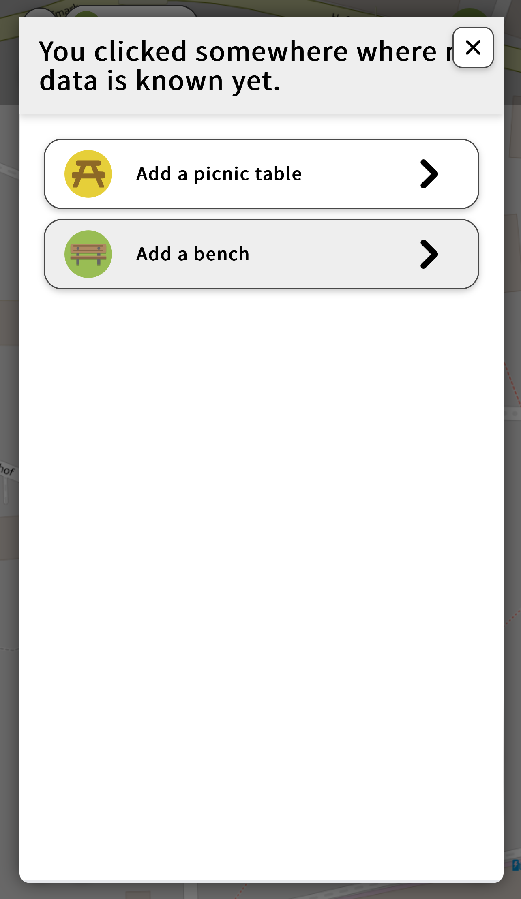
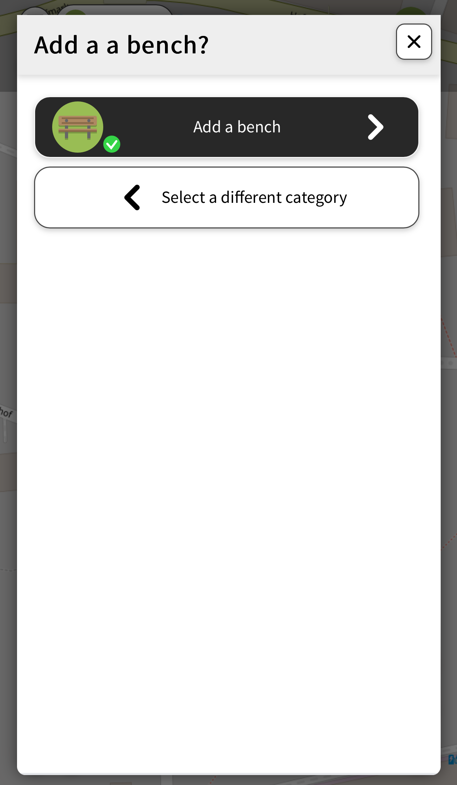
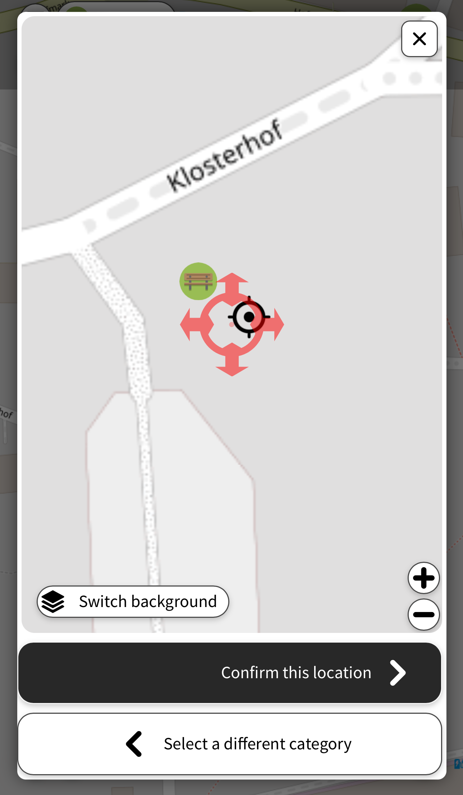
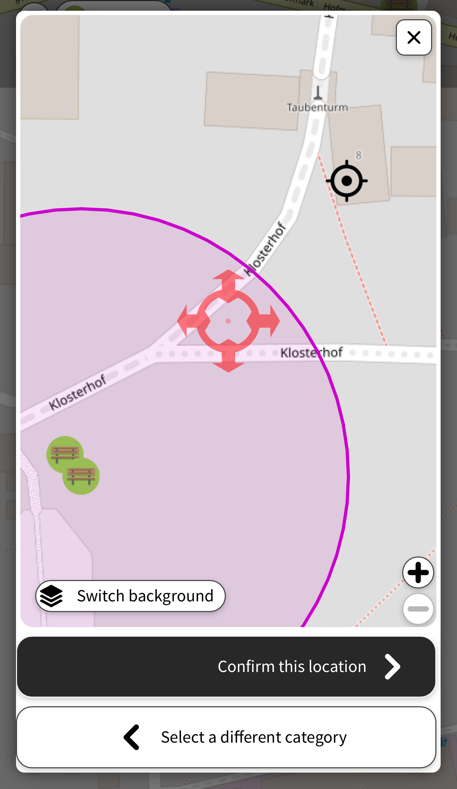

# Why is the flow to add a new point like it is?

I regularly get the question why a certain step is in the flow of adding a new point - often with the request to "simplify" this by omitting this step or by doing this completly differently.

Here are some more detailed examples of the flow, step by step:

This is the start screen

This screen could be skipped.  Users only have one choice here anyway, why is it still here?
 
 > This is a confirmation screen to make sure that a contributor picked the right option. In some themes, some extra explanations or example images are shown.

 Add a button to put red cross to current location. Under +/- circles.

> GPS accuracy cannot be trusted and is often off by several meters. People shouldn't trust this blindly, hence why this is deliberately not an option.

I don't understand this purple circle. What does this mean? I cant put the marker outside of it. But why?

> The user has to zoom in to z >= 18 before adding something. They have to inspect the loaded data nearby to prevent e.g. duplicate entries.
The rangelock is there to prevent people accidentally panning the map far away. This is often done accidentally, placing the icon where they don't expect it. Another possibility is that the data in that area is not yet loaded, resulting in a duplicate entry.

