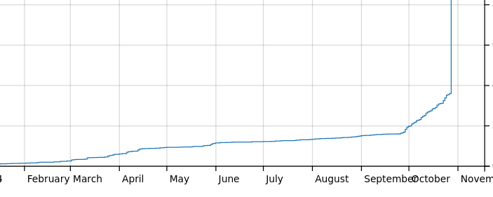
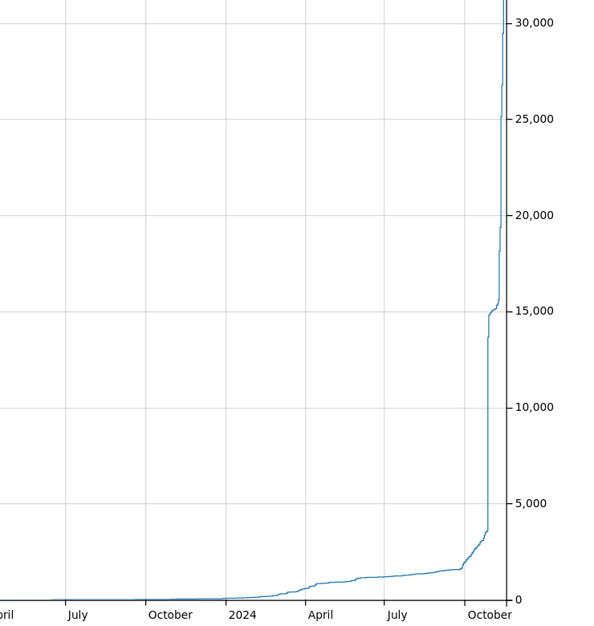
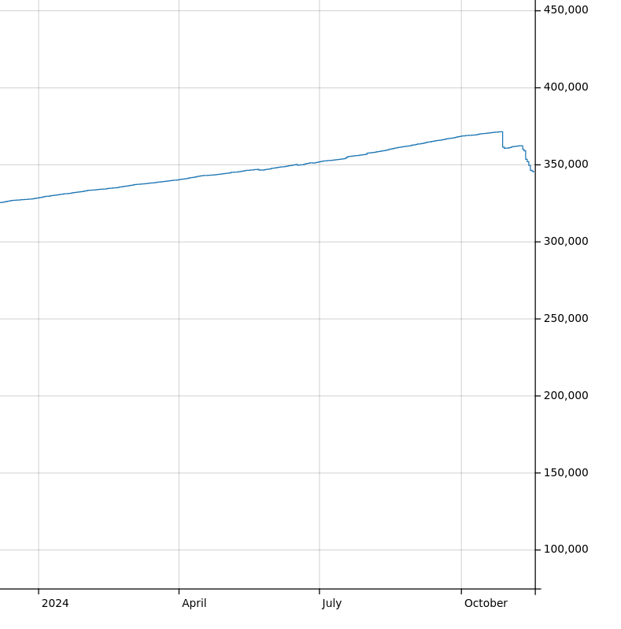

# Moving pictures from IMGUR to Panoramax: some thoughts and little facts

As you might know, I'm the main developer of [MapComplete](https://mapcomplete.org). For those who don't know, MapComplete is an OSM-viewer _and_ editor, where contributors can easily answer questions, add new points and upload pictures from a POI from a cozy website.
Instead of showing all data at once, it only shows one items within a single topic, resulting in many thematic maps to choose from.

Four years ago, I started with uploading images to IMGUR, a "free" (paid for by advertisements) image host. They were really permissive at the time, and I got the API up and running in about 15 minutes.
For the past four years, they served us well with barely any trouble. They rarely had outages and if there was one, it only lasted a few hours at most.

But it was not meant to last. The first crack in this relationship was a little over a year ago. Igmur changed their terms of use, making clear that they would remove "images that aren't watched often".
In practice, this was mostly meant to remove NSFW pictures from there platform, but it was a good excuse for us to start backing up all the imgur images linked to from OpenStreetMap.

The next omen was the change of terms. From being very permissive, those went to "please, don't use IMGUR as your Content Distribution Network", which pretty much is how MapComplete used IMGUR. Oops.
In [this forum thread](https://community.openstreetmap.org/t/usage-of-imgur-hosted-images/118806/6), I wrote _"I hope IMGUR wouldn't notice us before MapComplete made the switch to Panoramax"_.

Famous last words.

About a week later, our upload got blocked. Contributors were not able to upload new pictures anymore

As such, Thibault Mol setup a Panoramax instance to be used with MapComplete (thank you very much for this!).
I spent quite some time to change MapComplete to support panoramax as backend, making uploads possible again!

This has been notable in the [graph by TagHistory for Panoramax](https://taghistory.raifer.tech/?#***/panoramax/):
one can notice the graph going steeper during october:

## Moving all pictures

With all the machinery in place to upload to panoramax, I also created a script to upload the images from my backup to this panoramax instance.
I've been moving the pictures over in the past few weeks (before the divorce gets ugly and we get completely blocked off).
The technical details are documented on [the issue tracker](https://github.com/pietervdvn/MapComplete/issues/2189)

But, by now, there are 39.124 pictures in our Panoramax server. At most a few (<10) pictures made with MapComplete had been lost by now.
The script deleted a few more image links - mostly in Germany - but these links have been dead for a long time - the original image was linked about 12 year ago for some POI.

Ths can be seen when zooming out from the previous graph:

Even more impressive is the dent this makes in the [`image`-key graph](https://taghistory.raifer.tech/?#***/image/). About 39 out of 375K image tags were removed - close to 10% (!) of the image tags.
This means that MapComplete was responsible for 1 out of 10 images linked in OpenStreetMap.

## Why didn't you use panoramax from the start?

For the simple reason that it didn't exist back then ;)
Panoramax development only started in [2022](https://gitlab.com/panoramax/server/api/-/commit/7217aa9b3aa5345cbc7c9532a4a174b9a20cb813).
It works quite well, but there are still a few small issues to work out (especially regarding some legal screens and missing tooling, e.g. for moderation).
I'm sure these will appear in the near future!

However, all software grows with their users - especially if those users let the developers know what is still missing.
With that respect, I'm proud that this is the first Panoramax-server that is not related to the development team (being OSM-France and IGN France).
Again: Kudos to Thibault for creating and maintaining the server! And we'd like to encourage all local communities and other, similar projects to setup their own 
panoramax server!

## Downstream effects

Even cooler are the downstream effects. For starters, people who saw the 'imgur'-tags thought of Imgur to upload pictures to.
As such, some people started uploading pictures there to link to OSM because of MapComplete, but not using MapComplete.

At the same time, other editors have been noticing this and are thinking of implementing features that were pioneered by MapComplete,
such as thematic maps (such as the streetcomplete overlays) or having image uploads too.

## Support the project

Please, continue to support the project! The most obvious way is to [simply use it to make edit](https://mapcomplete.org),
by [reporting bugs](https://github.com/pietervdvn/MapComplete/issues) (but I'm swamped with work and studies right now, so it'll take a while before I'll look to your bug report)
or by [supporting me financially](https://liberapay.com/pietervdvn/)

You can follow us on Mastodon:

MapComplete: https://en.osm.town/@MapComplete
Edits made with mapcomplete, including some pictures: https://en.osm.town/@MapComplete_edits
Panoramax: https://mapstodon.space/@panoramax
My personal account: https://en.osm.town/@pietervdvn
And Thibault: https://en.osm.town/@thibaultmol
