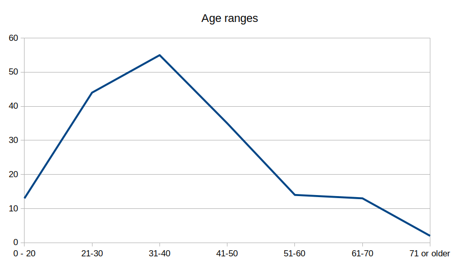
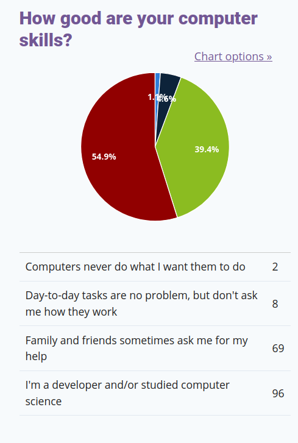
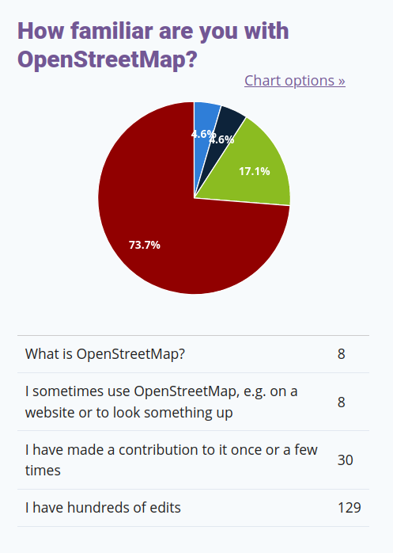

# MapComplete user census

As you noticed, MapComplete ran a user survey during january.
What did it tell us?

The use survey had a few goals, namely:

- discovering what demographies are using MapComplete (and which are missing)
- and discovering what needs and wants are still there

## Basic demography

The first question is of course: who did fill out the survey? If we look to the numbers, a clear pattern emerges.

The age distribution looks pretty normal - there is a clear peak around the bucket `30-40`, which falls down left and right.

The gender is not as balanced. Unsurprisingly, the majority of respondents is male:

Around 10% of respondents identified as female.
This indicates that women are vastly underrepresented in this survey - ideally they would be around 50%.

11 people identified as having a non-conventional gender.
Note that there was _no_ option for trans people - they could choose between either their chosen gender or use the 'something else'. As such, I don't know how much trans people are in each category. One person, identifying as female however stated to be trans (and I suspect that there are a few more).

Non conventional genders are thus vastly overrepresented in this survey. [According to Wikipedia](https://en.wikipedia.org/wiki/Non-binary_gender#Population_figures), about 0.5% of adult populations identify as non-binary. With 11 out of 177 respondents using a non-conventional gender, we end up at 6% - or ten times what we would expect if the OpenStreetMap-population would reflect the broader population. But, this also indicates that we are a welcoming community in that respect - or at least I hope so.

Another clear bias are the computer skills. 55% of _all_ respondents indicated that they are programmers - another huge overrepresentation:

Now, this is a bit painful. MapComplete aims to be an easy-to-use tool for non-technical users. The survey clearly failed to reach these people (and maybe MapComplete has a hard time reaching those people too).

This is also mirrored in the question on how good they know OpenStreetMap. Close to 75% indicate to have at least hundreds of edits.

For someone to fill out the survey, they first need to hear about it and find the link to fill it out. The communication and communication channels about the survey are thus important.
As the survey has been promoted via [Mastodon](https://en.osm.town/@mapcomplete), this probably had a major influence: Mastodon has a userbase which is both very developer-oriented but also quite queer as it has (relatively) many transgender and genderqueer people. As the post about the survey gained a lot of traction there, I suspect many found the survey via that channel (thus partly explaining those biases).

A second important effect is the language. The invitation for the survey and the survey itself where all in english. Developers are generally fluent in English, but a non-technical user might not bother with a survey that is not in their native tongue. As MapComplete is mostly popular in Belgium, Dutch- and French-speaking people might not feel compelled.

At last, some people from minorities are less likely to fill out surveys ([source](https://files.eric.ed.gov/fulltext/ED501717.pdf)). I tried to counter this by explicitly inviting those groups to fill out the survey in the request, but this psychological effect is very hard to measure.

As such, while I do think that the data is mostly representative of MapComplete-users and the OpenStreetMap-community, I think that less-technical people are a bit underrepresented.

### Identity

A last question in the 'demography'-set was "how would you describe yourself?" - a notoriously hard question which only 66 persons (37%) answered.

This question is intentionally open-ended, as people will normally state what _they_ find important in life.

18 of them mentioned to be a map lover or OSM lover, 15 self-identified as being a 'techie', 'developer', 'engineer' or similar. 8 found Open Source-software important; 7 mentioned to be interested in environmentalism, urbanism, transportation and/or political issues. Other notable mentions were to be involved (professionally) with GIS, to be a teacher (2), a cyclists (4) or a rock climbers (2). One person indicated that they were 'disabled'.

## Which thematic maps do people use?

56 people gave insight in their favourite maps, yielding a total of 86 mentions of specific map themes or groups of themes.

The theme with the most mentions -namely **9**- was the [**etymology**](https://mapcomplete.org/etymolgoy) theme. This is not a big surprise, as there has been a tremendous amount of changes made with Open Etymology-map. Some people mention curiosity for their local environment, others are interested in the link between OpenStreetMap and Wikipedia. It should be noted that nearly everyone who mentioned etymology indicates that they have hundreds of edits.

The second place goes to the [**waste**](https://mapcomplete.org/waste) theme with **8** mentions. I have to be honest, this came as a total surprise to me! At first sight, it is a bit of a boring topic - especially when contrasted with something like etymology. Yet, everyone needs to get rid of some waste every now and then. By the way, this theme was created by [@Rlin](https://en.osm.town/@rlin) and I have to admit that this is one of the most polished themes on MapComplete, using a lot of the available functionality. Thank you!

The third places goes to all **cycling-related** themes (**7** mentions of 'cycling'). [Cyclofix](https://mapcomplete.org/cyclofix) had another **5** mentions, resulting in **12 total** mentions. This was no surprise either, as cyclofix has been historic driver of many changes made with MapComplete. It is one of the [oldest maps on MapComplete](https://en.osm.town/@pietervdvn/109297539270300156), yet it is still popular and is embedded on a few websites.

The third place goes to [**benches**](https://mapcomplete.org/benches) with **7** mentions - another very down-to-earth topic but with lots of value and lots of unmapped features.

Out of the other answers, it is clear that there are various reasons to use MapComplete:

- For practical, day-to-day reasons, such as searching for information about POI (e.g. waste, benches, restaurants, pubs, toilets), commuting (cycling, charging stations) or a professional interest
- Because it helps them with their hobby, especially outdoor-hobbies such as recreational cycling, climbing
- Out of personal curiosity or wonder in the world (etymology and artwork)
- They add data because they want to help other people (benches, AED, hydrants, drinking water, toilets, wheelchair, osm-for-the-blind, adding pictures) - which sometimes even touches upon activism (one person mentioned that _Speed limits map helped me to discuss about mobility with my municipality._)

A full table of total mentions can be found below

Map | Total |
|----|------|
[etymology](https://mapcomplete.org/etymology) |	9
[waste](https://mapcomplete.org/waste) |	8
Anything cycling-related |	7
[benches](https://mapcomplete.org/benches) |	7
[cyclofix](https://mapcomplete.org/cyclofix) |	5
[wheelchair](https://mapcomplete.org/on_wheels) and [blind_osm](https://mapcomplete.org/blind_osm) |	5
[charging_stations](https://mapcomplete.org/charging_stations) |	4
[aed](https://mapcomplete.org/aed) |	3
[trees](https://mapcomplete.org/trees) |	3
[hydrants](https://mapcomplete.org/hydrants) |	3
[drinking_water](https://mapcomplete.org/drinking_water) |	3
[artwork](https://mapcomplete.org/artwork) |	3
[notes](https://mapcomplete.org/notes) |	2
[shops](https://mapcomplete.org/shops) |	2
[restaurants](https://mapcomplete.org/restaurants) |	2
[healthcare](https://mapcomplete.org/healthcare) |	2
[bookcases](https://mapcomplete.org/bookcases) |	2
[toilets](https://mapcomplete.org/toilets) |	2
[ghost_bike](https://mapcomplete.org/ghost_bike) |	2
[street_lamps](https://mapcomplete.org/street_lamps) |	2
[personal](https://mapcomplete.org/personal) |	1
[pubs](https://mapcomplete.org/cafes_and_pubs) |	1
[nature](https://mapcomplete.org/nature) |	1
[Fritures](https://mapcomplete.org/Fritures) |	1
[climbing](https://mapcomplete.org/climbing) |	1
[pinjepunt](https://mapcomplete.org/toerisme_vlaanderen) |	1
[speed](https://mapcomplete.org/speed_limits) | 	1
[surveillance](https://mapcomplete.org/surveillance) |	1
[pets](https://mapcomplete.org/pets) |	1

## What do people still want?

I did ask several open-ended question to gauge interests and for bugs, namely:

- If you could wish for a map-based application, what would this application do?
- What features would you like to see in MapComplete?

### Question: If you could wish for a map-based application, what would this application do?

This open-ended question came quite early in the survey - even before mentioning MapComplete. This is an intentionally broad question, in order to generate as much ideas as possible and to get a feel of what people's general grievances are.

56 people gave a very extensive answer to this question, but as answers touch upon different topics, it's very hard to categorize them.

However, there were a few recurrent themes:

- OpenStreetMap got often compared to Google Maps. Some liked the convenience of that mapping platforms, where others openly wished for open/libre/privacy-respecting alternatives for Google Maps
- Search was another common grievance
- Routing was mentioned often as well. Quite a few mappers want a routing engine, taking them to places that need to be updated in OSM or Mapillary; others have specific needs (such as car-free, indoor routing, with live data or offline)
- At last, some people would love to see features from some app to appear in some other app as well.

### Question: What features would you like to see in MapComplete?

Another open-ended question where people can report bugs and feature requests.

The most popular request is to be able to build MapComplete-map easily, with 7 such requests in 59 answers. Good news: part of the NL-Net grant is building a new Custom-theme-builder!

Furthermore, an **offline mode** was a popular request with **5** mentions. Similarly, **3** people asked for an installable app. Good news for them too: MapComplete is a _Progressive Web App_, which means you can 'install' it on your mobile phone via the menu. It's a glorified bookmark on your homescreen - but it opens full-screen. Furthermore, aggressive caching makes that it _should still open and show some data_ for a previously visited location and map theme! 

There were 7 requests for various improvements to specific themes and a few requests for advanced features which might or might not fit the concept of an 'easy to use'-map editor.

### Houston, we have problem...

Another problem surfaced in the previous question. A big chunk of answers made it clear that there is still a lot of confusion with [the android app **StreetComplete**](https://play.google.com/store/apps/details?id=de.westnordost.streetcomplete) - namely 11 answers (or 6% of _all_ respondents)...

This implies that the results of this survey should be interpreted as being about the _OpenStreetMap-community_, not about users of MapComplete specifically.

And it also brings us to our next topic:

## How well-known is MapComplete?

Not that well-known, it seems. In the previous question, 11 people out of 59 who took the time to fill out this question, mistook MapComplete for StreetComplete. This is a clear sign that there is still some work to do.

### How did people get to know MapComplete?

How did people get to know MapComplete in the first place?

Via **Reddit** (13 mentions), **Twitter** and [**Mastodon**](https://en.osm.town/@MapComplete) (13 mentions) and the **Weekly OSM** (9 mentions).

There are honorouble mentions for **online chatrooms** (6 mentions), word of mouth (6 mentions), the OSM-forum (3 mentions) or 'arriving via a specific map' (3 mentions).

From these results, it's clear that the online spaces where I regularly pitch MapComplete (namely Reddit and Mastodon) also resulted in some people discovering MapComplete.

However, this makes me wonder how applications such as StreetComplete and EveryDoor got to such a big userbase quickly. It seems that creating a mobile phone app with offline capabilities helps with this.

## Good questions to ask next year?

I'm planning on doing a similar survey next year (or in one year and a half) to see how things evolve. To be able to compare results, it is interesting to have the same questions, even though some improvements can probably be made (e.g. in wording and more nuanced options).

It is also hard to gauge if people are part of a marginalized group. As such, it is hard to know if we reach those people as well.

But there might be room for other good questions. If you have suggestions, feel free to let them know

## Anything else you'd like to say?

This was the question with the most uplifting answers, as many, many people wrote in a compliment about how much they like MapComplete and the work I did! (Well, some of them were probably thinking about StreetComplete)

Thank you everyone involved!

## Conclusions

To wrap it up:

- OpenStreetMap is a very male-dominated community
- People use MapComplete because it fits their activities and hobbies, it helps them professionally, as activists, to help other people or for daily issues
- There are many different needs and wants in the community
- MapComplete is not well-known yet, we should consider different branding and communicate more
- The community would like a custom theme builder and offline capabilities (e.g. as an app)
