# Research: search functionality

How do various mapping platforms offer the 'search'-functionality?
This research in preparation for the search functionality

## Google

The search bar is visible from the start at the top left.

When the search bar is focused, the 'recent'-searches are shown.

When typing a category, options for this category are listed in the sidebar and on the map.
Hovering over them will shop a pin on their location on the map.

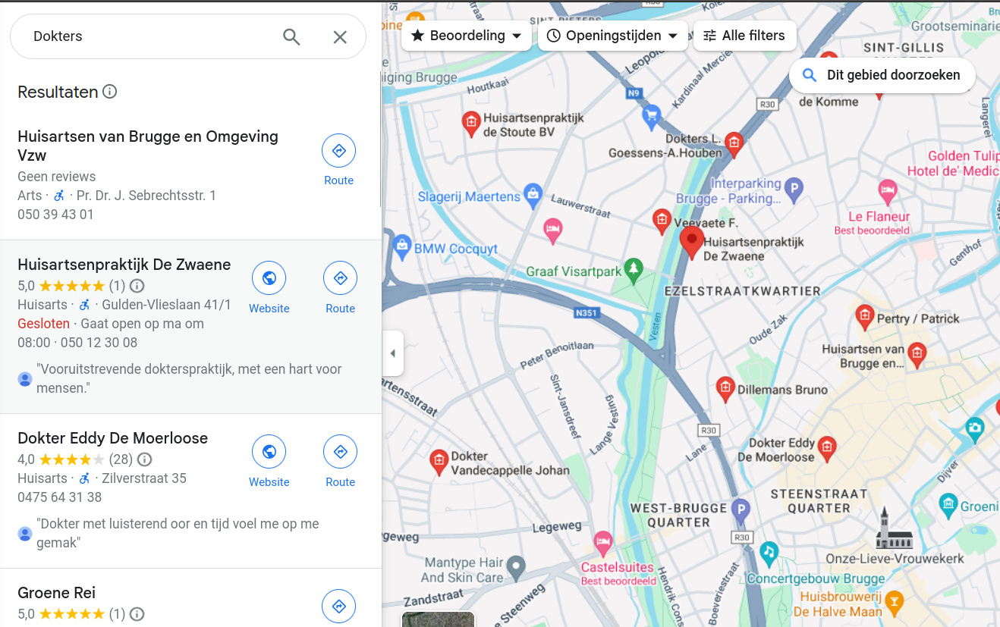

Note that filters are suggested on the top left.

When clicking a docter, another side bar (more to the middle) shows the basic info, never obscuring the search results:

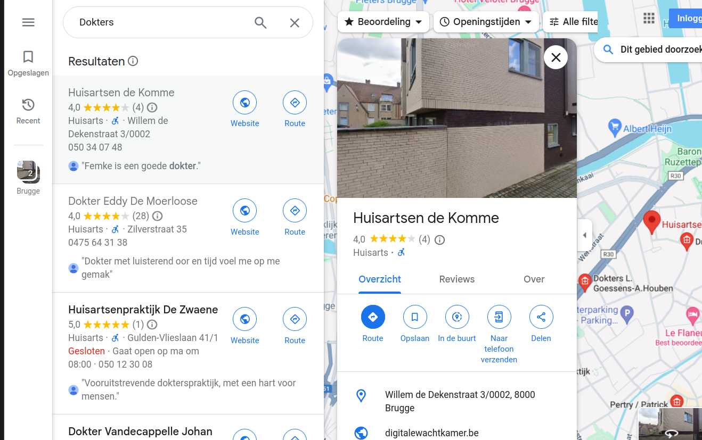

### Mobile

The sidepanels are shown fullscreen, the map view is not visible

## Apple

### Desktop

The newly launched apple Maps has a prominent side bar, showing 'search', 'guides' and 'directions'.

Clicking the search opens another sidebar, which features:

1. The search bar
2. Recently searched
3. Find Nearby (with some common POI categories)

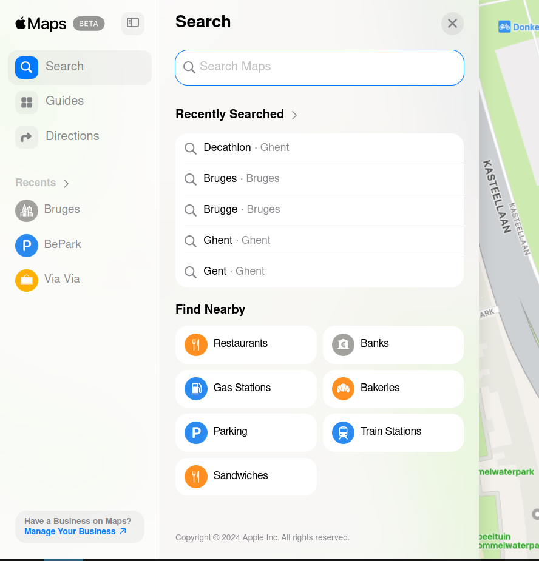

Starting to type a search will offer some options under the searchbar; searching results in many options.
This searches nearby (< 100km) and shows a not very obvious pin on the map.
Hovering over an option in the UI has no effect on the map.

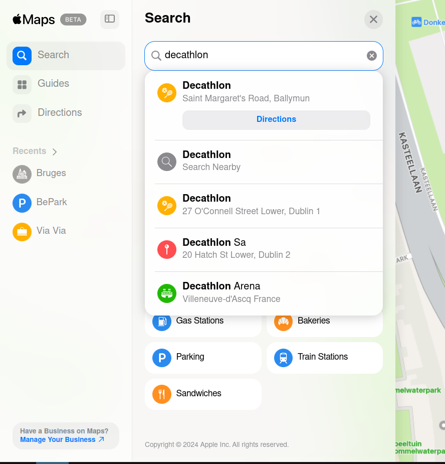
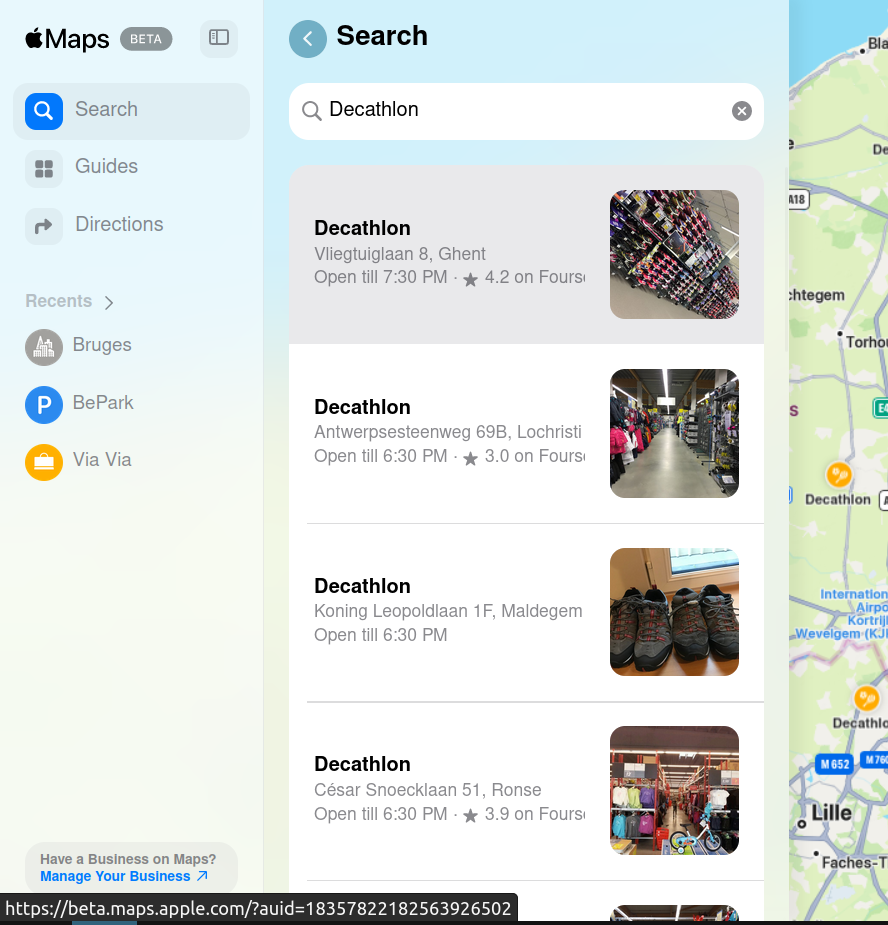

Searching a place will open a new sidebar, with some basic information, e.g. the wikipedia article and some pictures

### Mobile

The browser version is not supported on small screens - except on iPhones.
Luckily, there are [plenty online ](https://www.youtube.com/watch?v=m6p3nGzHPUk)[tutorials around](https://www.youtube.com/watch?v=hH1uV1jXY58)

A similar pattern appears here, even though, when selecting an option from the search result list, this option will receive a huge pin.

## Bing

### Desktop 

Very similar to google/Apple

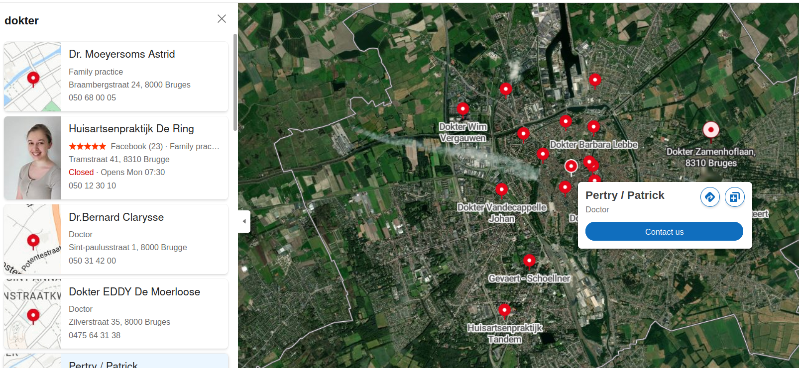

A popup on the map is shown on hover, but utterly useless as _unhovering_ the entry will hide the popup.
This popup is also triggered when hovering the pin, but here it _is_ possible to move into the popup.

However, clicking the entry or pin will open the entry for the POI:

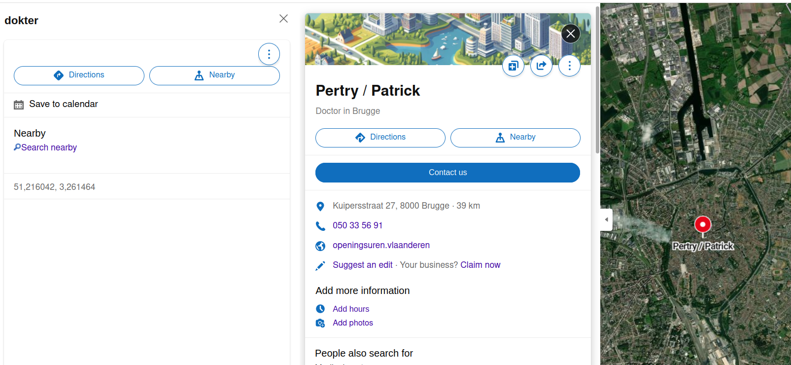

### Mobile

(Note: trying the responsive design doesn't properly work)

A bottom card shows all the entries, the map view is completely hidden

## OpenStreetMap

A simple list with entries is shown on the left, hovering an entry will reveal the location on the map

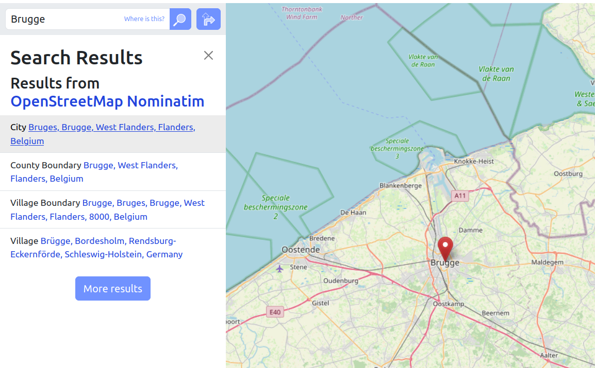

## Here Maps (Here We Go)

(Note: does not work on librewolf)

This offers a very clean, minimalistic approach with cold colours.
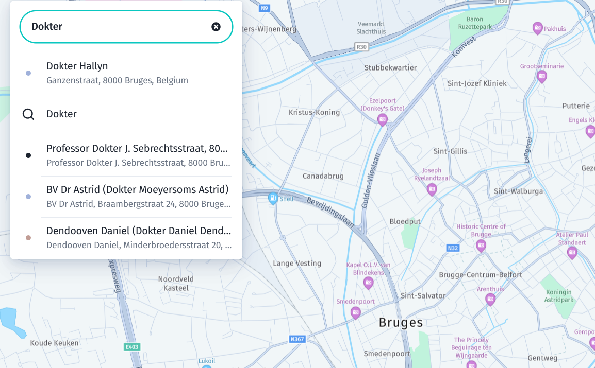
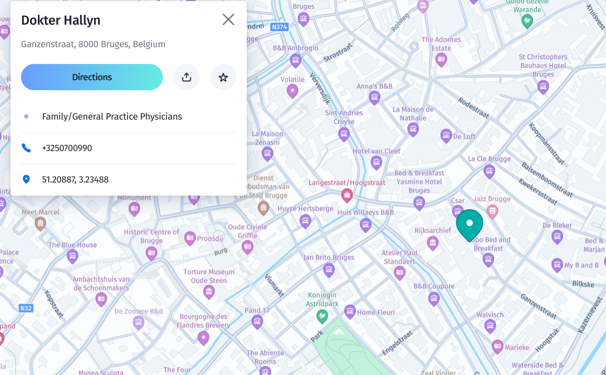
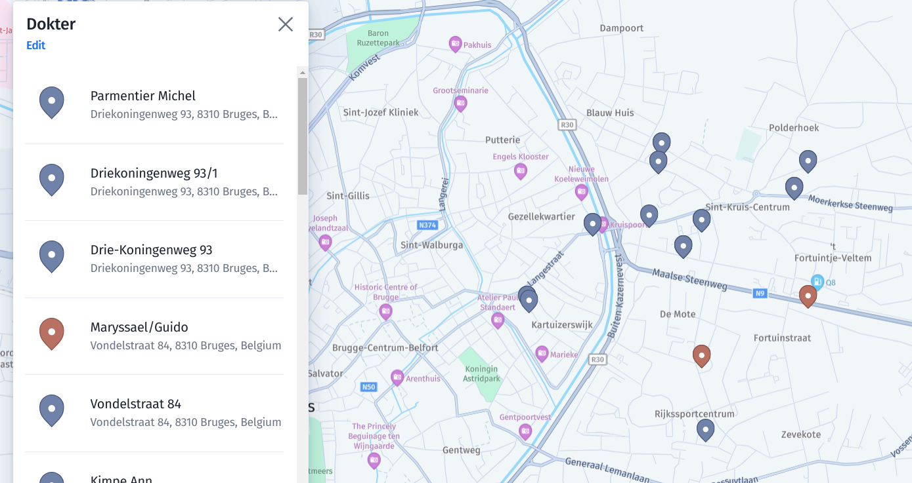

Note that search pins where _two_ entries are at the same location, get a different colour.

## OsmAnd

OsmAnd is not known for it's userfriendliness.

The flow is:

1. Select the search button
2. A screen is opened with a search button on top + tab with recents, categories, ...
3. Typing text will search addresses, placenames and categories
4. Selecting a category will show them as dot on the map

# Other considerations

Support for coordinates (some always interpret lat, lon) and optional reverse geocoding (#1599)
Support for OSM-ids (e.g. node/123, https://osm.org/node/123) (#1671)
Support for layers (categories) and/or switching themes

Switch themes (or layers) via search (https://github.com/pietervdvn/MapComplete/issues/1385)
Open the popup on exact match (https://github.com/pietervdvn/MapComplete/issues/1385)
https://github.com/pietervdvn/MapComplete/issues/1480
