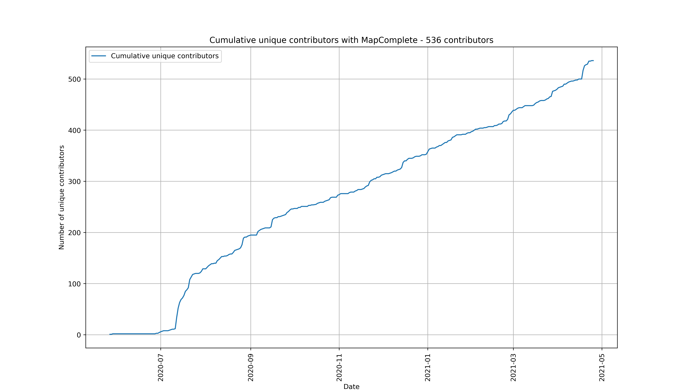

Statistics
==========

There are some fancy statistics available about MapComplete use. The most important once are listed below, some more graphs (and the scripts to generate them) are [in the tools directory](Tools/) 

All Time usage
--------------

Note: in 2020, MapComplete would still make one changeset per answered question. This heavily skews the below graphs towards `buurtnatuur` and `cyclofìx`, two heavily used themes at the beginning.

2020
----

2021
----

