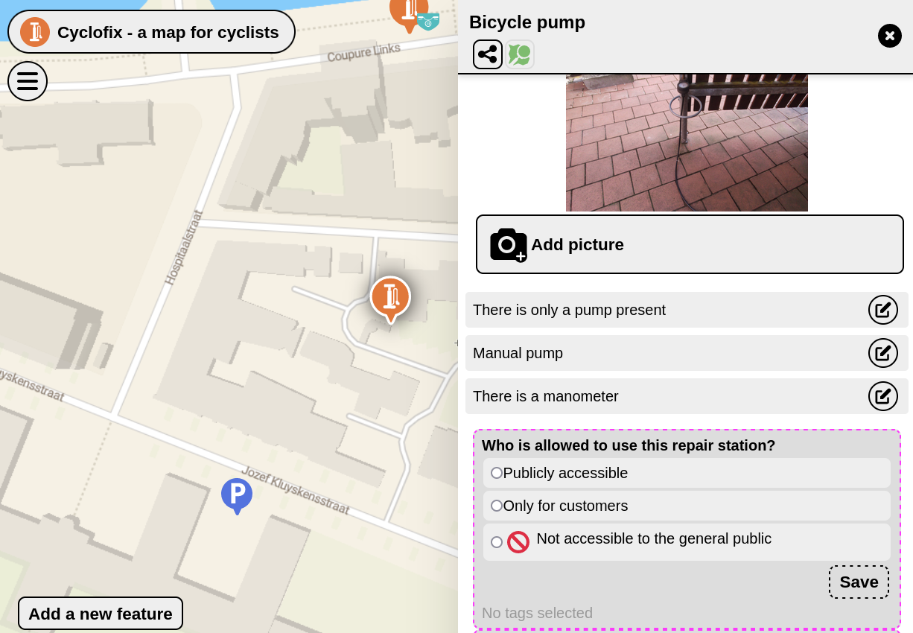
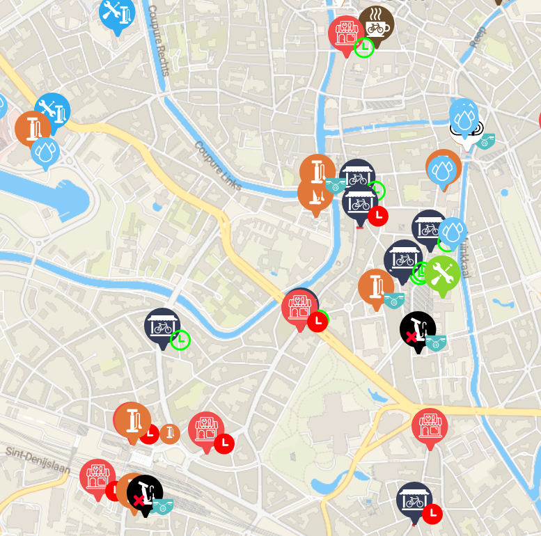
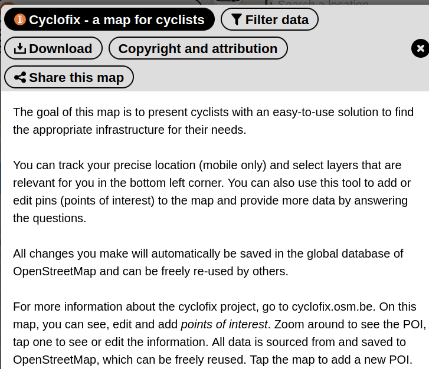
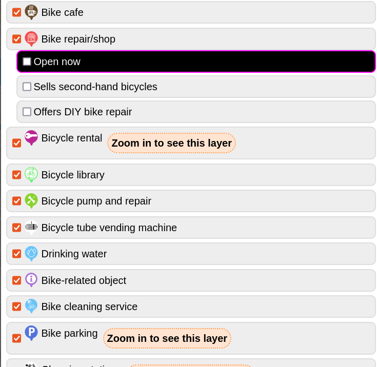

# Welcome to MapComplete Studio

Hi!

Welcome to MapComplete Studio.

These slides will walk you through the most important concepts to use MapComplete Studio effectively

# What is OpenStreetMap?

[OpenStreetMap](https://openstreetmap.org) is a worldwide, collaborative project where we map the world together.

People worldwide do add data about features around the world, such as streets, shops, toilets, infrastructure, ...

All type of objects are welcome to be added into OpenStreetMap, as long as:

1. *The object can be verified on the ground and is present*
2. *The object is permanent*

The following items are thus *not* welcome:

- Do not add events such as a festival
- Do not add measurements of e.g. air quality, traffic counts, ... [Sensor.Community](https://sensor.community/) is the right place for this
- Do not add points that are only interesting to you (e.g. the route of your next trip). [UMap](https://umap.openstreetmap.fr) is the right tool for this 
- Do not add privacy-sensitive information, e.g. the names of persons living in a house
- Do not add data about now demolished items, such as 'there was a battle here 100 years ago' or 'there was a school here, before it was completely demolished and rebuild'. This can be added to [OpenHistoricalMap](https://www.openhistoricalmap.org/) instead.

# How can OpenStreetMap data be reused?

OpenStreetMap data can be reused freely, including for commercial purposes. However, you have to:

1. Give attribution
2. Keep the data open - changes to data based on OpenStreetMap must be published under the same license.

See the [full copyright notice](https://osm.org/copyright) for details

This also means that we are *not* allowed to copy data from other maps. Do not enter data based on Google Maps!

# How does OpenStreetMap organise the data?

In OpenStreetMap, the geodata can be one of three types:

- **Points** which have a geocoordinate
- **Lines** which are a _list_ of points. Closed lines are used to represent polygons
- **Relations** which are a _list_ of points, lines and/or other relations.

All of those objects have a set of **attributes**. These are pairs of a **key** and a **value** which tell us what a point or line does represent. For example, `amenity=bench` represents a sitting bench. 

You can find the meaning of all those keys and values on the [OpenStreetMap-wiki](https://wiki.openstreetmap.org/)

# OpenStreetMap does **not** have layers

Many traditional GIS-applications organise the data into layers.

OpenStreetMap does not do this. Consider this place:

This place has three functions:

- It is a shop, selling boardgames
- It is a café, where one can drink a tea (while testing one of the board games)
- It is a social inclusion project for people with a mental disability

In a traditional system with layers, one would either have to choose the most fitting layer (e.g. the layer `pub`, `shops` or `social facility`? ) losing the multi-facetted aspect of the place. 
Another approach could be to add it to all three layers, duplicating the data. However, this makes maintaining the data harder.

# What is MapComplete?

MapComplete is a map viewer and editor. A contributor is presented a *thematic map* with features that are relevant to this topic.

These features are based on OpenStreetMap. If some data is not known, the user will be asked some **questions** and is invited to answer them. These answers are sent back to OpenStreetMap, updating it there.

Data can also be loaded and visualised from external sources. No changes can be made to this externally loaded data in that case.

# MapComplete _does_ have layers

A layer in mapcomplete describes a single type of object, e.g. _shops_, _toilets_, _benches_, _public bookcases_.

A layer tells us:

- What features to load from OpenStreetMap - thus what attributes the displayed data should have
  - (Or where to find the data if we are using an external datasource)
- How these should be displayed on the map
- What should be shown in the popup...
- ... and what questions should be asked
- How to create a _new point_ onto the map

# MapComplete does have themes

A _theme_ is a **collection of layers**, with a title and a description.

For example, [cyclofix](https://mapcomplete.org/cyclofix) has many bicycle-related layers (of which items are shown on the map) and an introduction.

# Studio

In MapComplete Studio, you can create and edit layers and themes to tweak it for your needs. 

As a reminder:

- [OpenStreetMap](https://openstreetmap.org) is an open, geographical database which can be reused under [a permissive license](https://openstreetmap.org/copyright)
- MapComplete visualises data (mostly) from OpenStreetMap and can add new points and attributes to OpenStreetMap
- MapComplete works with layers; which can be bundled into a theme

Have fun creating your custom MapComplete-map!
