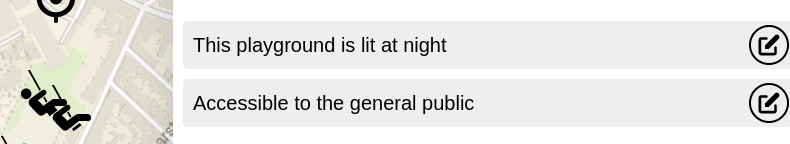
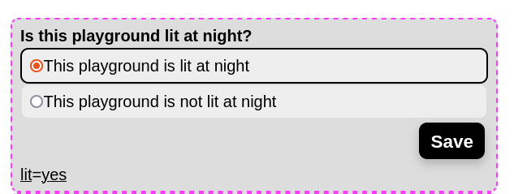
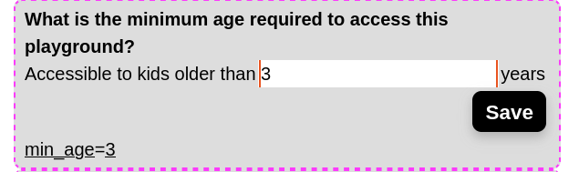
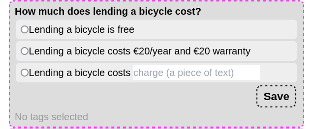
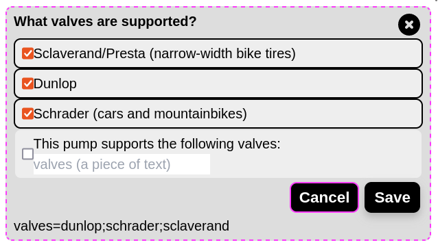
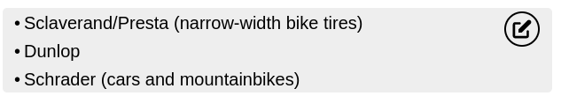

# How to work with TagRenderings

The information box shows various attributes of the selected feature in a human friendly way.

This is done by a **tagRendering** which converts attributes into text.

This can be done by using **predefined options** (mappings) or with a **render**-string

# Predefined options

A predefined option states that, `if` a certain tag is present, `then` a certain text should be shown.

For example, a playground may be lit or not.
In OpenStreetMap, this is encoded with the tag `lit=yes` or `lit=no`. We might want to show `This playground is lit at night` and `This playground is not lit at night` to users of MapComplete.

This is what this will look like in the interface:

# Substituting attributes

If none of the predefined options match, the string given in the `render`-field is used (under the question _"What text should be rendered?"_).

A special property about all shown texts is that, **if the name of a key appears between braces, this will be replaced by the corresponding value**.

For example, if the object has tags `min_age=3` and the text to display is `Accessible to kids older than {min_age} years`, then this will be displayed to the user as **Accessible to kids older than 3 years**

Note that this also works withing predifined options

# Special values

Special components can be summoned by calling them. For example, the relevant wikipedia will be displayed by entering the text `{wikipedia()}`. A table with opening hours is displayed with `{opening_hours()}`. For a full reference, [see the documentation](https://github.com/pietervdvn/MapComplete/blob/master/Docs/SpecialRenderings.md).

# Requesting data with predefined options

These renderings can be turned into a way to contribute data easily. If a **question** is provided, then these renderings will be asked if unknown or gain the pencil to make changes. 

A predefined option will show up as an option that can be picked.

# Requesting data with an input field

It is also possible to have a text field. For this, the **key** to write into must be given (_What is the name of the attribute that should be written to?_), in this case `max_age`.

# Combining predefined options and freeform text

A text field and predefined options can be combined. The contributor can then choose between a predefined option or filling out something.

# Selecting multiple values

One can set a question to allow multiple answers. This works with predefined options or a freeform text field.

Note that these will be rendered as a list:

