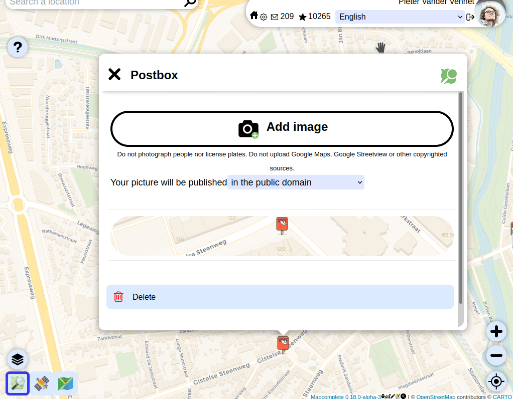

# MapComplete

> Let a thousand flowers bloom

 

**MapComplete is an OpenStreetMap viewer and editor.** The main goal is to make it trivial to see and update information on OpenStreetMap, also for non-technical users.
This is achieved by showing only features related to a _single topic_ on the map. MapComplete contains many thematic maps, each built for a certain community of users, showing data and questions that are highly relevant for this topic.
By showing only objects on a single topic, contributors are not distracted by objects that are not relevant to them.
Furthermore, this allows to show (and ask for) attributes that are highly specialized (e.g. a widget that determines tree species based on pictures) but also by reusing common attributes and elements (such as showing and adding opening hours or pictures).

**The design goals** of MapComplete are to be:

- Easy to use, both on web and on mobile
- Easy to deploy (by not having a backend)
- Easy to set up a custom theme
- Easy to fall down the rabbit hole of OSM

**The basic functionality is** to download some map features from Overpass and then ask certain questions. An answer is
sent back to directly to OpenStreetMap.

Furthermore, it shows images present in the `image` tag or, if a `wikidata` or `wikimedia_commons`-tag is present, it
follows those to get these images too.

**An explicit non-goal** of MapComplete is to modify geometries of ways, especially generic geometry-editing. (Splitting
roads is possible and in some restricted themes is geometry-conflation possible too). If adding geometry would be supported, we'd also have to show all geometries (to avoid accidental intersections).
This would invite to show and map these other geometries as well, resulting in a general-purpose editor. However, we already [have an excellent, web-based general purpose editor](https://wiki.openstreetmap.org/wiki/ID).

**More about
MapComplete:** [Watch Pieter's talk on the 2021 State Of The Map Conference](https://media.ccc.de/v/sotm2021-9448-introduction-and-review-of-mapcomplete) ([YouTube](https://www.youtube.com/watch?v=zTtMn6fNbYY))
about the history, vision and future of MapComplete.

## What's the difference with StreetComplete?

This is the repository of _Map_ Complete. _Street_ Complete is an Android-only application where the contributor is shown some questions to solve, after which the pin will dissappear from the map.

StreetComplete can thus be seen as a Todo-map for contributors who go on a stroll, whereas MapComplete is a website showing relevant information and which allows to add or update information.

The codebases are separate, even though many ideas and some artwork are copied from the StreetComplete app.

# Documentation

**All documentation can be found in [the documentation directory](Docs/)**

## Dev

To develop or deploy a version of MapComplete, have a look [to the guide](Docs/Development_deployment.md).

## Creating your own theme

It is possible to quickly make and distribute your own theme, [please read the documentation on how to do this](Docs/Making_Your_Own_Theme.md).

The main developer is currently _not_ taking requests for new themes (unless they are commissioned). There are simply to much good thematic maps to make.
We do however encourage you to try to create your own theme yourself - we'll gladly accept it as official theme if it meets the criteria.

## Examples

- [An overview of all official themes](https://mapcomplete.org).
- [Buurtnatuur.be](http://buurtnatuur.be), developed for the Belgian [Green party](https://www.groen.be/). They also
  funded the initial development!
- [Cyclofix](https://mapcomplete.org/cyclofix.html), further development
  on [Open Summer of Code](https://summerofcode.be/) funded
  by [Brussels Mobility](https://mobilite-mobiliteit.brussels/en). Landing page at https://cyclofix.osm.be/
- [Bookcases](https://mapcomplete.org/bookcases.html) cause I like to collect
  them.
- [Map of Maps](https://mapcomplete.org/maps.html),
  after a tweet
- [A build of the develop branch can be found here](https://pietervdvn.github.io/mc/develop)

There are plenty more. [Discover them in the app](https://mapcomplete.org/index.html).

### Statistics

To see statistics,
consult [OsmCha](https://osmcha.org/?filters=%7B%22comment%22%3A%5B%7B%22label%22%3A%22%23mapcomplete%22%2C%22value%22%3A%22%23mapcomplete%22%7D%5D%2C%22date__gte%22%3A%5B%7B%22label%22%3A%222020-07-05%22%2C%22value%22%3A%222020-07-05%22%7D%5D%7D)
or the [analytics page](https://pietervdvn.goatcounter.com/)

## User journey

MapComplete is set up to lure people into OpenStreetMap and to teach them while they are on the go, step by step.

A typical user journey would be:

0. Oh, this is a cool map of _my specific interest_! There is a lot of data already...

    * The user might discover the explanation about OSM in the second tab
    * The user might share the map and/or embed it in the third tab
    * The user might discover the other themes in the last tab

1. The user clicks that big tempting button 'login' in order to answer questions - there's enough of these login
   buttons... The user creates an account.

2. The user answers a question! Hooray! The user transformed into a __contributor__ now.

    * When at least one question is answered (aka: having one changeset on OSM), adding a new point is unlocked

3. The user adds a new POI somewhere

    * Note that _all messages_ must be read before being able to add a point.
    * In other words, sending a message to a misbehaving MapComplete user acts as having a **zero-day-block**. This is
      added deliberately to make sure new users _have_ to read feedback from the community.

4. At 50 changesets, the [personal layout](https://mapcomplete.org/personal.html) is advertised. The
   personal theme is a theme where contributors can pick layers from all the official themes. Note that the personal
   theme is always available.

5. At 200 changesets, the tags become visible when answering questions and when adding a new point from a preset. This
   is to give more control to power users and to teach new users the tagging scheme

6. At 250 changesets, the tags get linked to the wiki

7. At 500 changesets, I expect contributors to be power users and to be comfortable with tagging scheme and such. The
   custom theme generator is unlocked.

## License

GPLv3.0 + recommended pingback.

I love it to see where the project ends up. You are free to reuse the software (under GPL) but, when you have made your
own change and are using it, I would like to know about it. Drop me a line, give a pingback in the issues,...

## Translating MapComplete

The core strings and builtin themes of MapComplete are translated
on [Hosted Weblate](https://hosted.weblate.org/projects/mapcomplete/core/). You can easily make an account and start
translating in their web-environment - no installation required.

You can even jump to the right translation string directly from MapComplete:

## Architecture

### High-level overview

The website is purely static. This means that there is no database here, nor one is needed as all the data is kept in
OpenStreetMap, Wikimedia (for images), Imgur. Settings are saved in the preferences-space of the OSM-website, amended by
some local-storage if the user is not logged-in.

When viewing, the data is loaded from overpass. The data is then converted (in the browser) to geojson, which is
rendered by Leaflet.

When a map feature is clicked, a popup shows the information, images and questions that are relevant for that object.
The answers given by the user are sent (after a few seconds) to OpenStreetMap directly - if the user is logged in. If
not logged in, the user is prompted to do so.

The UI-event-source is a class where the entire system is built upon, it acts as an observable object: another object
can register for changes to update when needed.

### Searching images

Images are fetched from:

- The OSM `image`, `image:0`, `image:1`, ... tags
- The OSM `wikimedia_commons` tags
- If wikidata is present, the wikidata `P18` (image) claim and, if a commons link is present, the commons images

### Uploading images

Images are uploaded to Imgur, as their API was way easier to handle. The URL is written into the changes.

The idea is that once in a while, the images are transferred to wikipedia or that we hook up wikimedia directly (but I
need some help in getting their API working).

### Uploading changes

In order to avoid lots of small changesets, a changeset is opened and kept open. The changeset number is saved into the
users preferences on OSM.

Whenever a change is made -even adding a single tag - the change is uploaded into this changeset. If that fails, the
changeset is probably closed and we open a new changeset.

Note that changesets are closed automatically after one hour of inactivity, so we don't have to worry about closing
them.

# Privacy

Privacy is important, we try to leak as little information as possible. All major personal information is handled by
OSM. Geolocation is available on mobile only through the device's GPS location (so no geolocation is sent of to Google).

TODO: erase cookies of third party websites and API's

# Attribution and Copyright

The code is available under GPL; all map data comes from OpenStreetMap (both foreground and background maps).

Background layer selection: curated by https://github.com/osmlab/editor-layer-index

Icons are attributed in various 'license_info.json'-files and can be found in the app.
